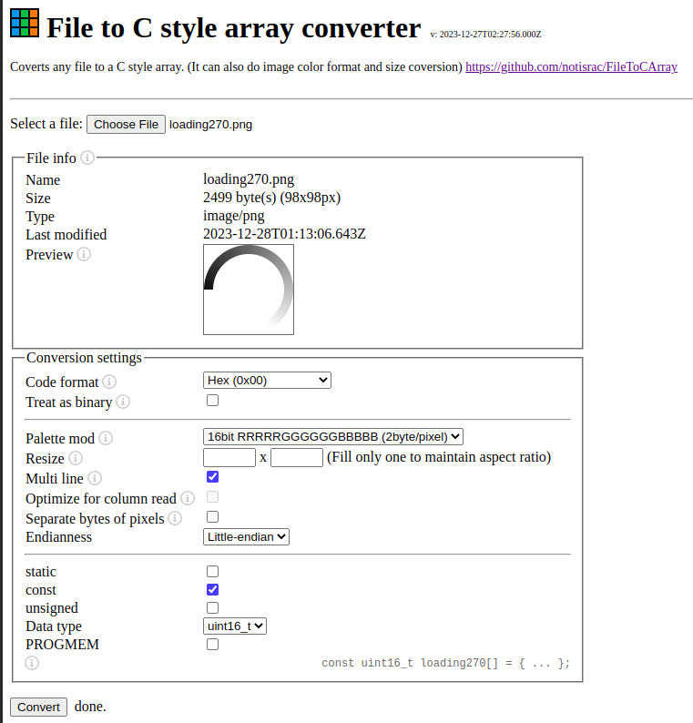

# nucleo

- SPI1_MCLK: PA5
- SPI1_MOSI: PA7
- LCD_CS: PB6
- LCD_DC: PC7
- LCD_RST: PA9
- USART1_TX: PA2
- USART1_RX: PA3

- https://github.com/microsoft/jacdac-stm32x0/blob/51f3ad972413e38e7ba45a9d124830acdd5ae868/stm32/sspi.c#L72
- https://github.com/Floyd-Fish/ST7789-STM32
- https://github.com/ScarsFun/STM32F4_ST7789_LL_DMA
- https://github.com/zst-embedded/STM32-LCD_Font_Generator
- https://notisrac.github.io/FileToCArray/
